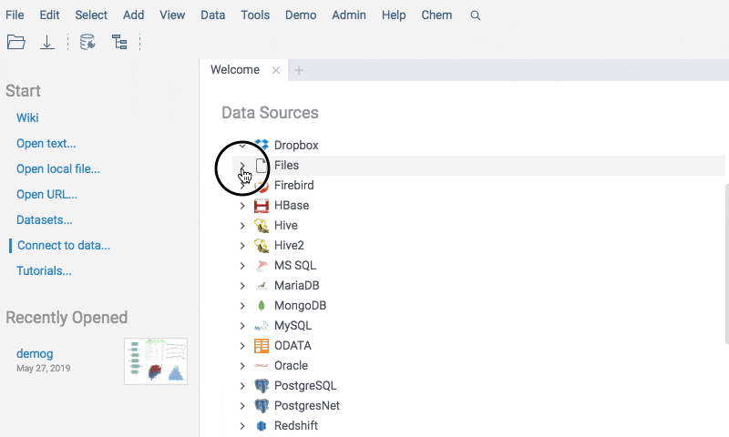

<!-- TITLE: Files -->
<!-- SUBTITLE: -->

# Files

File shares are often used for storing and exchanging data, and Datagrok provides first-class
support for them. Once a file share is mounted as a network drive on a server and registered
within the platform, its content gets automatically [indexed](../../features/files-indexer.md)
and can be browsed.

Our indexing mechanism understands 
[most popular file formats](../../features/importing-data.md#supported-file-types), 
including archives such as .tar or .zip, or Excel files. This enables powerful browsing. 
For instance, you can quickly browse columns in a particular data sheet in an Excel file that 
resides within a zip file.

In addition to browsing, it is also possible to search for tables using  
[metadata](../../concepts/metadata.md) that
gets extracted during the indexing process. For example, you might want to find tables
that were created in the last month that have at least two columns, one of them containing
molecules and another named "activity". It is also possible to perform such a search
across all (or specified) data providers (including relational databases, etc) at once.   

See also:

  * [Data Source](data-source.md)
  * [Data Connection](data-connection.md)
  * [Files Indexer](../../features/files-indexer.md)
